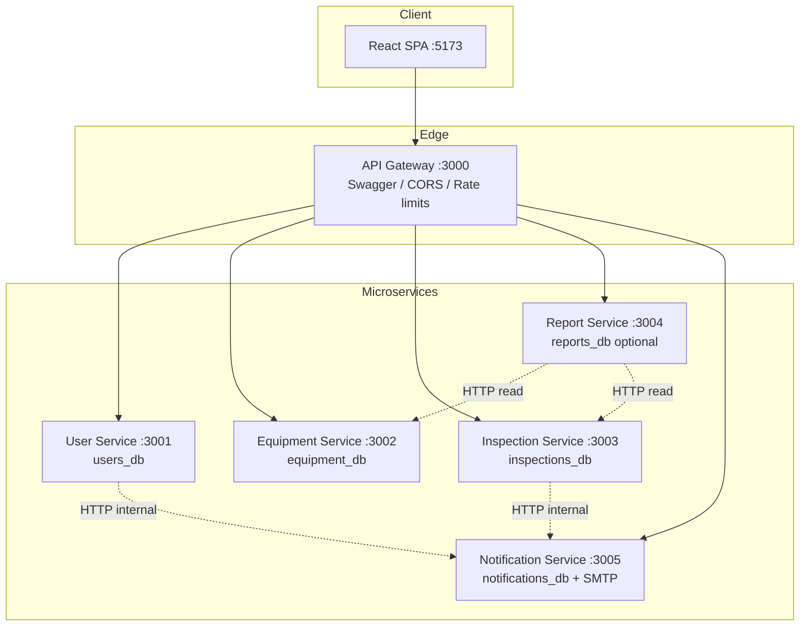
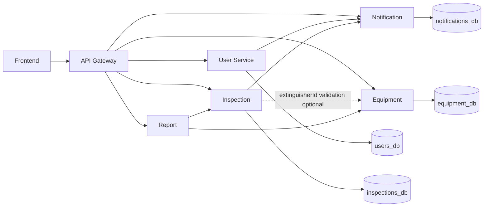

# TWZ Fire System — Implementation Plan

**Generated:** 2026-06-04  
**Purpose:** Requirement coverage, gap analysis, and implementation roadmap before any code changes.  
**Sources (priority order):** `docs/scenario.md` → intended `docs/architecture.md` (missing) → intended `docs/project-brief.md` (missing) → `docs/project-brief-missingcodes.md` → `docs/frontend-brief-codes.md` → existing source code + `api-gateway/src/swagger.json`.

**Hard constraints (this project):**

- RESTful microservices architecture
- PostgreSQL only (one database per service)
- **Redis is not part of the architecture and must not be introduced**
- JWT authentication + role-based authorization (admin, inspector, user)
- Swagger/OpenAPI via API Gateway
- React frontend consuming REST APIs
- Pagination on all list endpoints
- PDF and CSV report export
- Logging, CORS, and security protections

---

## 1. Documentation Status

| Document | Path | Status |
|----------|------|--------|
| Scenario / grading criteria | `docs/scenario.md` | Present |
| Technical architecture | `docs/architecture.md` | **Missing** |
| Project brief | `docs/project-brief.md` | **Missing** |
| Reference backend implementations | `docs/project-brief-missingcodes.md` | Present (includes Redis — **must not be adopted as-is**) |
| Reference frontend implementations | `docs/frontend-brief-codes.md` | Present |
| API contract (runtime) | `api-gateway/src/swagger.json` | Present |

Until `architecture.md` and `project-brief.md` are added, treat **`scenario.md` + `swagger.json` + microservice layout** as the authoritative technical shape, with `project-brief-missingcodes.md` as implementation reference **after removing Redis** and aligning OTP storage with PostgreSQL.

---

## 2. Target Architecture (Reconstructed)

| Service | Port | Database | Responsibility |
|---------|------|----------|----------------|
| API Gateway | 3000 | — | Reverse proxy, Swagger UI, global security |
| User Service | 3001 | `users_db` | Auth, users, refresh tokens, audit logs, **OTP persistence (PostgreSQL)** |
| Equipment Service | 3002 | `equipment_db` | Extinguisher CRUD + stats |
| Inspection Service | 3003 | `inspections_db` | Inspections + maintenance logs |
| Report Service | 3004 | `reports_db` (optional) | Dashboard aggregation, PDF/CSV export |
| Notification Service | 3005 | `notifications_db` | Email delivery (internal `POST /send`) |
| Frontend | 5173 | — | SPA, role-based UI |

---

## 3. Requirement Coverage Matrix

Legend: **Done** | **Partial** | **Missing** | **N/A** (non-code deliverable)

### Activity 1 — Analysis & Design

| ID | Requirement (scenario.md) | Status | Evidence / Gap |
|----|---------------------------|--------|----------------|
| A1.1 | Microservices + REST API contract (Swagger) | **Partial** | Gateway + `swagger.json` (~23 paths); backends not implemented |
| A1.2 | Database model design | **Partial** | 6 Sequelize model files; none registered in `models/index.js` |
| A1.3 | Figma signup mock-up | **N/A** | Design deliverable; not in repository |

### Activity 2 — User Management

| ID | Requirement | Status | Evidence / Gap |
|----|-------------|--------|----------------|
| A2.1 | Roles: Admin, Inspector, User | **Partial** | Enum in `user.model.js` + Swagger; RBAC middleware exists, unused |
| A2.2 | User registration API (firstName, lastName, email, password) | **Missing** | Required by scenario; **no** `/api/auth/register` in Swagger; only admin `POST /api/users` |
| A2.3 | JWT login / logout | **Partial** | `jwt.js` real; `auth.controller.js` stub; routes not mounted |
| A2.4 | Role-based authorization | **Partial** | `authorize()` in each service; no live endpoints |
| A2.5 | Profile update, change password, password recovery | **Partial** | Documented in Swagger; controllers stubbed |
| A2.6 | OTP / email verification for login | **Partial** | `otp.js` uses **Redis (invalid)**; must move to PostgreSQL; notification-service empty |
| A2.7 | Signup/login via frontend | **Missing** | `Login.jsx`, `App.jsx`, `api.js` stubbed |
| A2.8 | Admin creates users + temp password email | **Missing** | In reference brief + Swagger; not implemented |

### Activity 3 — Fire Extinguishers & Operations

| ID | Requirement | Status | Evidence / Gap |
|----|-------------|--------|----------------|
| A3.1 | Register extinguisher (serial, location, type, size, dates, status) | **Partial** | Model + route validators; controller stub; routes not mounted |
| A3.2 | List all extinguishers (paginated) | **Partial** | Swagger + `Extinguishers.jsx` (brief); no backend pagination |
| A3.3 | View by ID | **Partial** | Route + `ExtinguisherDetail.jsx` real; backend missing |
| A3.4 | Update / delete extinguisher | **Partial** | Routes defined; controller stub |
| A3.5 | Schedule inspection + notify personnel | **Partial** | `Inspection` model + routes; notification not implemented |
| A3.6 | Inspector maintenance logging | **Partial** | `MaintenanceLog` model + routes; controller stub |

**Domain note:** Scenario lists types Water, CO2, Foam, Dry Chemical and sizes 2.5/5/9/12 lbs. Code/Swagger add `wet_chemical`, `halon`, and `20lbs` — acceptable extension if documented.

### Activity 4 — Reporting

| ID | Requirement | Status | Evidence / Gap |
|----|-------------|--------|----------------|
| A4.1 | Stock counts (daily, monthly, yearly) | **Missing** | Swagger mentions breakdowns; no `report.controller.js` |
| A4.2 | Inspection status report | **Missing** | Dashboard aggregation not implemented |
| A4.3 | Expired extinguishers report | **Missing** | Depends on equipment service queries |
| A4.4 | Maintenance history report | **Missing** | Depends on inspection service |
| A4.5 | Real-time dashboard | **Partial** | Swagger `GET /api/reports/dashboard`; frontend stub |
| A4.6 | PDF export | **Missing** | `pdfkit` in package.json only |
| A4.7 | CSV export | **Missing** | `json2csv` in package.json only |

### Activity 5 — Testing, Deployment, Instructions

| ID | Requirement | Status | Evidence / Gap |
|----|-------------|--------|----------------|
| A5.1 | Document REST APIs (Swagger UI) | **Done** | Gateway serves `/api-docs` |
| A5.2 | Export database to repository | **Missing** | No SQL dumps, migrations, or seed export scripts |
| A5.3 | PDF/CSV export (instruction #57) | **Missing** | See A4.6–A4.7 |
| A5.4 | Handover to repository | **Partial** | Repo structure exists; not runnable end-to-end |
| I1 | React frontend | **Partial** | 6 pages implemented; 12 core files stubbed |
| I2 | Node.js backend | **Partial** | Scaffold only |
| I3 | PostgreSQL only | **Partial** | Sequelize configured; **Redis present in code — violation** |
| I4 | JWT auth | **Partial** | Utils/middleware exist; flow not wired |
| I5 | Pagination on all lists | **Partial** | Swagger + some UI; **zero backend implementation** |
| I6 | Display logs properly | **Partial** | `morgan` on all services; no structured audit/application logging |
| I7 | CORS + web security | **Partial** | Gateway: helmet, CORS, rate limits; services: helmet only |
| I8 | Responsive, good-looking UI | **Partial** | CSS/styling in brief; `index.css` stubbed |

---

## 4. Gap Analysis (Summary)

### 4.1 Completed (runnable or structurally sound)

- Monorepo workspace (`package.json`, `scripts/install-all.js`, `concurrently` dev script)
- **API Gateway:** proxy routes, health check, Swagger UI, helmet, CORS, rate limiting, morgan logging
- **OpenAPI spec:** auth, users, extinguishers, inspections, maintenance, reports (23 path keys)
- **Sequelize model definitions** (6 entities across 3 services)
- **Route skeletons** with validation + JWT guards (equipment, inspection, report)
- **Auth utilities:** `password.js`, `jwt.js` (user-service)
- **JWT middleware** duplicated per service (pattern established)
- **Frontend feature pages (partial):** Users, Profile, Inspections, Maintenance, ExtinguisherDetail, NotFound
- **Dockerfiles** (7) + frontend `nginx.conf`
- Per-service `.env` files and root `.env.example`

### 4.2 Partially completed

| Area | What exists | What is missing |
|------|-------------|-----------------|
| User service | Models, utils, middleware | Model registration, controllers, routes, mount, seed script fix |
| Equipment / Inspection | Models, routes | Controllers, model registration, mount |
| Report service | Routes, deps declared | Controller, HTTP aggregation, PDF/CSV |
| Notification service | Deps, middleware file | Routes, nodemailer templates, email log model |
| Frontend | 6 pages | Bootstrap: App, main, api, auth store, layout, auth pages, dashboard, lists, reports, CSS |
| Security | Gateway protections | Service-level rate limits unused; gateway OTP path mismatch |
| Pagination | Swagger + UI query params | Controller `offset/limit` + `{ data, pagination }` responses |

### 4.3 Missing requirements

**Backend services / wiring**

- All business logic in 6 controllers (currently 1-line stubs)
- `auth.routes.js`, `user.routes.js` (stubs)
- Route mounting in all 5 service `index.js` files (only `/health` today)
- `models/index.js` registration + associations in user, equipment, inspection services
- Notification service: `POST /api/notifications/send` (internal)
- Report service: dashboard + export implementation
- **PostgreSQL OTP table** and rewritten `otp.js` (remove Redis)
- **User self-registration** endpoint per `scenario.md` (unless formally waived)
- `docker-compose.yml` (PostgreSQL instances only — **no Redis service**)
- Database export script / migration strategy for handover
- `Start-App.ps1` referenced in `.env.example` (missing)

**Frontend**

- Copy/implement 12 stub files from `docs/frontend-brief-codes.md`
- Signup/registration page (scenario + instruction #4) if registration API is added
- Forgot-password page (Login links to `/forgot-password` — route missing in stub `App.jsx`)

**APIs (documented but not implemented)**

All Swagger paths under `/api/auth/*`, `/api/users/*`, `/api/extinguishers/*`, `/api/inspections/*`, `/api/maintenance/*`, `/api/reports/*`, plus gateway-proxied `/api/notifications/*` (undocumented in Swagger).

**Database entities**

| Entity | Model file | Registered | Table created |
|--------|------------|------------|---------------|
| User | yes | no | no |
| RefreshToken | yes | no | no |
| AuditLog | yes | no | no |
| OtpCode (required) | **no** | no | no |
| Extinguisher | yes | no | no |
| Inspection | yes | no | no |
| MaintenanceLog | yes | no | no |
| EmailLog (recommended) | no | no | no |

**Reports**

- Dashboard JSON (extinguishers, inspections, maintenance, time buckets)
- PDF stream (pdfkit)
- CSV stream (json2csv)

**Swagger gaps**

- `/api/notifications/send` (internal) not documented
- No public registration path (scenario gap)
- OTP rate limiter on gateway targets wrong path (`/api/auth/otp` vs `/api/auth/verify-otp`)

**Security gaps**

- Refresh token rotation/revocation not implemented
- Audit logging on admin actions not implemented
- `api-gateway/src/middleware/auth.middleware.js` unused; `jsonwebtoken` not in gateway `package.json`
- Service `express-rate-limit` dependencies unused

---

## 5. Missing Components List (Checklist)

### Infrastructure

- [ ] `docker-compose.yml` (Postgres ×5, all services, frontend — **no Redis**)
- [ ] `docs/architecture.md` (recommended: add canonical doc without Redis)
- [ ] `README.md` with setup, env, seed, run order
- [ ] DB export / seed scripts for repository handover
- [ ] Sequelize migrations (optional but recommended vs `sync({ alter })` only)

### User Service (3001)

- [ ] Register models in `models/index.js`
- [ ] Add `OtpCode` model (PostgreSQL): `userId`, `purpose`, `codeHash`, `expiresAt`, `usedAt`
- [ ] Rewrite `utils/otp.js` — **remove ioredis**
- [ ] Implement `auth.controller.js`, `user.controller.js`
- [ ] Implement `auth.routes.js`, `user.routes.js`
- [ ] Mount `/api/auth`, `/api/users`
- [ ] Fix `seed-admin.js`
- [ ] Add `POST /api/auth/register` if scenario registration is in scope
- [ ] Pagination on `GET /api/users`, `GET /api/users/audit-logs`

### Notification Service (3005)

- [ ] `POST /api/notifications/send` + nodemailer templates (otp, welcome, inspection_scheduled, password_reset)
- [ ] Optional `EmailLog` model in `notifications_db`
- [ ] Remove unused `ioredis` dependency

### Equipment Service (3002)

- [ ] Register `Extinguisher` model
- [ ] Implement `extinguisher.controller.js` (list with pagination, CRUD, stats)
- [ ] Mount `/api/extinguishers`

### Inspection Service (3003)

- [ ] Register `Inspection`, `MaintenanceLog` models
- [ ] Implement controllers; call notification on schedule
- [ ] Mount `/api/inspections`, `/api/maintenance`
- [ ] Pagination on list endpoints

### Report Service (3004)

- [ ] Implement `report.controller.js` (dashboard + export)
- [ ] HTTP calls to equipment + inspection services
- [ ] PDF/CSV generation
- [ ] Mount `/api/reports`
- [ ] Daily/monthly/yearly aggregates per scenario

### API Gateway (3000)

- [ ] Fix OTP rate limit path to `/api/auth/verify-otp`
- [ ] Add Swagger paths for notifications (internal) or mark as internal-only
- [ ] Remove or fix unused `auth.middleware.js`

### Frontend

- [ ] Implement all stub files from `frontend-brief-codes.md`
- [ ] Registration/signup UI (if API added)
- [ ] Forgot-password / reset-password pages
- [ ] Wire export buttons on Reports page

### Dependency cleanup (architecture compliance)

- [ ] Remove `ioredis` from `user-service` and `notification-service` `package.json`
- [ ] Remove `REDIS_URL` from all `.env` files when implementing compose

---

## 6. Module Dependencies

| Module | Depends on | Blocks |
|--------|------------|--------|
| PostgreSQL (all DBs) | — | Every service |
| Notification Service | PostgreSQL, SMTP | User login OTP, user create email, inspection notify |
| User Service | PostgreSQL, Notification | All authenticated APIs |
| Equipment Service | PostgreSQL, User JWT secret | Inspections, Reports |
| Inspection Service | PostgreSQL, Notification, (Equipment) | Reports, Dashboard |
| Report Service | Equipment + Inspection APIs | Dashboard, Reports UI |
| API Gateway | All service URLs | Frontend |
| Frontend | Gateway + User auth flow | E2E testing |

**Critical path:** PostgreSQL → Notification → User (auth) → Equipment → Inspection → Report → Frontend bootstrap → remaining UI.

---

## 7. Recommended Implementation Order

| Phase | Work | Rationale |
|-------|------|-----------|
| **0 — Architecture compliance** | Remove Redis; design `OtpCode` in PostgreSQL; document decision in `architecture.md` | User-mandated constraint; blocks correct auth |
| **1 — Data layer** | Register all models; add `OtpCode`; run sync/migrations; fix `seed-admin` | Tables must exist before controllers |
| **2 — Notification service** | Email send endpoint + templates | Unblocks OTP login and user onboarding |
| **3 — User service** | Auth + user controllers/routes; mount; pagination; optional `/api/auth/register` | All other services need JWT |
| **4 — Equipment service** | Full CRUD + stats + pagination | Core domain |
| **5 — Inspection service** | Schedule + maintenance + notify + pagination | Depends on equipment IDs |
| **6 — Report service** | Dashboard aggregates + PDF/CSV export | Depends on 4–5 |
| **7 — API Gateway polish** | OTP rate limit path; Swagger updates | Security + docs accuracy |
| **8 — Frontend core** | Stubs → `frontend-brief-codes.md` | Unblocks E2E |
| **9 — Frontend completion** | Signup/forgot flows; align with APIs | Scenario instruction #4 |
| **10 — DevOps & handover** | `docker-compose` (no Redis), DB export, README | Activity 5 |

**Reuse rule:** Copy logic from `docs/project-brief-missingcodes.md` into stub files; **replace Redis OTP with PostgreSQL**; keep existing file names, mount paths, and middleware patterns.

---

## 8. Estimated Project Completion

| Layer | Weight | Completion | Notes |
|-------|--------|------------|-------|
| Documentation / design artifacts | 10% | 40% | scenario + swagger; missing architecture.md, project-brief.md, Figma |
| API Gateway | 10% | 85% | Proxy + Swagger + security largely done |
| OpenAPI accuracy | 5% | 80% | Missing notifications; registration gap |
| Database / models | 15% | 35% | Files exist; not registered; no OTP table |
| User + auth | 20% | 15% | Utils only; Redis violation |
| Equipment + inspection | 20% | 20% | Routes only |
| Reports + export | 10% | 5% | Deps declared |
| Notification | 5% | 5% | Shell only |
| Frontend | 15% | 30% | ~50% of pages; 0% bootstrap |
| DevOps / DB handover | 5% | 10% | Dockerfiles only |

### **Overall estimated completion: ~28%**

(Runnable product against `scenario.md` grading criteria: **~15–20%** until controllers are mounted and frontend boots.)

---

## 9. Reference File Mapping

When implementing, use these sources without inventing new patterns:

| Target (stub in repo) | Source |
|-----------------------|--------|
| `services/*/controllers/*.js` | `docs/project-brief-missingcodes.md` |
| `services/user-service/src/routes/*.js` | `docs/project-brief-missingcodes.md` |
| `services/user-service/src/utils/otp.js` | **New PostgreSQL implementation** (do not copy Redis version) |
| `frontend/src/**` stubs | `docs/frontend-brief-codes.md` |
| API contract | `api-gateway/src/swagger.json` |
| Business acceptance tests | `docs/scenario.md` |

---

## 10. Open Decisions (Resolve Before Coding)

1. **User registration:** Implement `POST /api/auth/register` per scenario, or document waiver (admin-only provisioning per Swagger)?
2. **OTP storage:** Confirm PostgreSQL `otp_codes` table in `users_db` (recommended).
3. **Single vs multi Postgres host:** Reference brief uses 5 containers; local dev may use one server with 5 databases (current `.env` pattern).
4. **Add missing docs:** Create `docs/architecture.md` and `docs/project-brief.md` from this plan to prevent future drift.

---

*Next step after approval: Phase 0–1 (remove Redis, register models, notification + user service) — no application code changes until this plan is accepted.*
